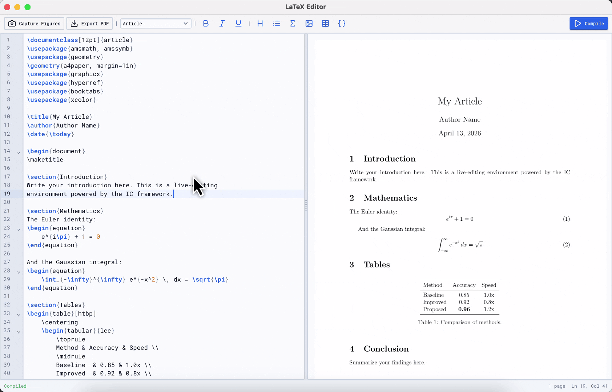

# IC Framework

<a href="https://uk.mathworks.com/matlabcentral/fileexchange/183586-ic-figure-components"></a>

Interactive components for MATLAB figures.

<p align="center">
  
</p>

## Quick start

Create a figure and insert an `ic.Frame`. The frame is the root component of the IC framework: any other component can be nested inside with `addChild()`

```matlab
fig = uifigure();
gl  = uigridlayout(fig, "RowHeight", {'1x'}, "ColumnWidth", {'1x'});
frame = ic.Frame("Parent", gl);
frame.addChild(ic.Button()); % add any component!
```

## Examples

### LaTeX Editor

Full LaTeX editor with live preview, PDF export, and figure capture.

<p align="center">
  
</p>

```matlab
ic.examples.LatexEditor();
```

### Surface Explorer


3D surface plot with TweakPane controls.

<p align="center">
  
</p>

```matlab
ic.examples.SurfaceExplorer();
```

## Components

| | |
|---|---|
| **Form** | Button, ToggleButton, Slider, RangeSlider, Knob, Switch, Checkbox, RadioButton, SegmentedButton, Select, MultiSelect, TreeSelect, ColorPicker, SplitButton, InputText, TextArea, Password, SearchBar |
| **Display** | Label, Image, ProgressBar, CircularProgressBar, Spinner |
| **Data** | Table, VirtualTable, Tree, VirtualTree, FilterTree, VirtualFilterTree, TreeTable, VirtualTreeTable |
| **Layout** | FlexContainer, GridContainer, Splitter, TabContainer, TileLayout, Accordion, Panel |
| **Renderers** | Latex, Markdown, Typst, Mermaid, PDFViewer |
| **Editors** | CodeEditor, RichEditor, NodeEditor |
| **Maps** | Leaflet-based maps with markers, polylines, polygons, GeoJSON, WMS, heatmaps |
| **Overlays** | Dialog, Drawer, Toast, Popover |
| **Tweakpane** | Parameter tuning panel with slider, color, point, bezier, rotation blades and more |

## Getting started

1. Download from the [File Exchange](https://uk.mathworks.com/matlabcentral/fileexchange/183586-ic-figure-components) or from the latest release from Github
2. Add the framework to your MATLAB path
3. Run one of the examples above

## Documentation

[ic-matlab.netlify.app](https://ic-matlab.netlify.app/)

## Requirements

MATLAB R2024b or later.

## License

See [LICENSE](LICENSE).
